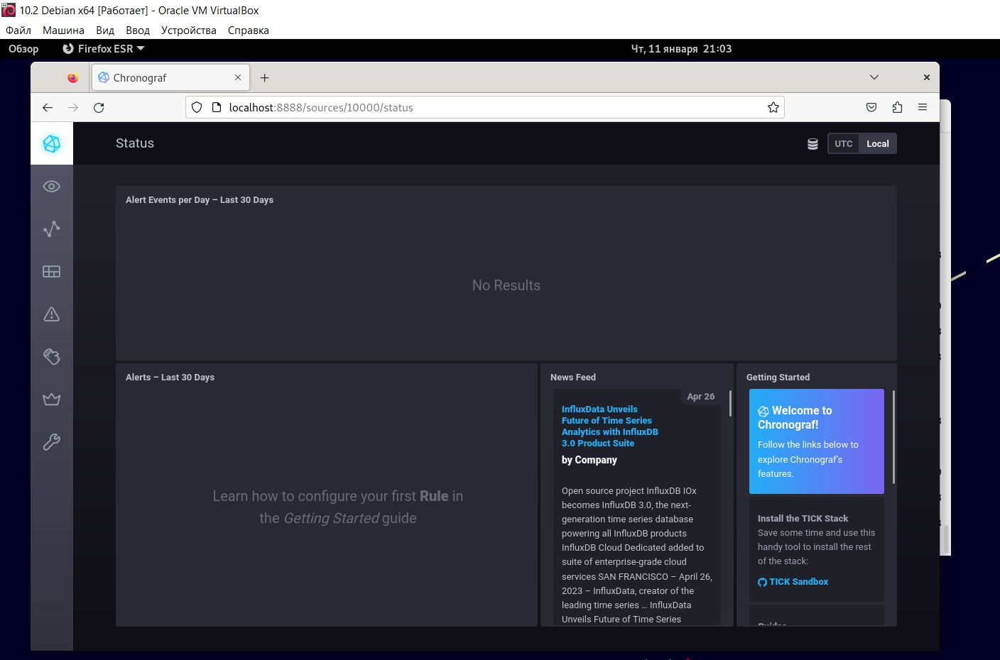
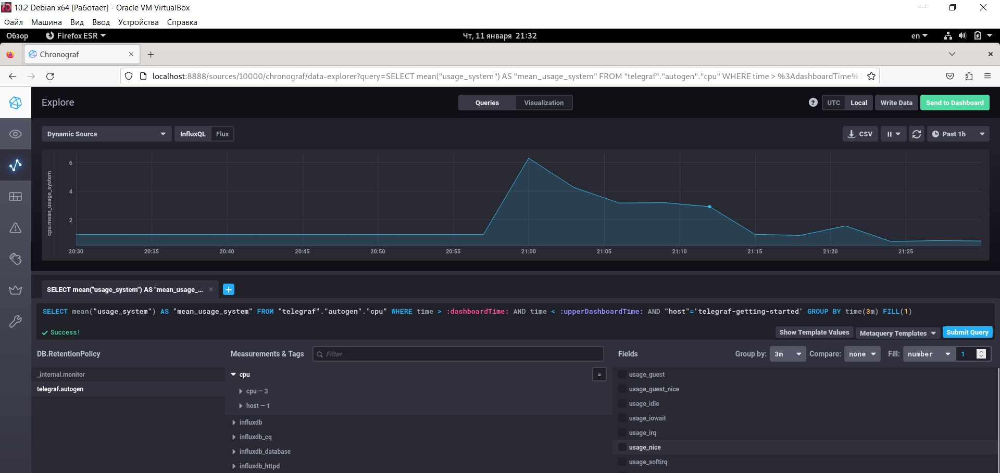
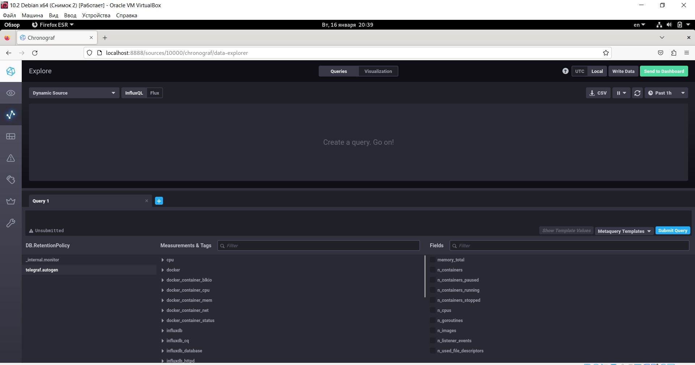

# Домашнее задание к занятию "13.Системы мониторинга" - Баранков Антон"

### Задание 1
Вас пригласили настроить мониторинг на проект. На онбординге вам рассказали, что проект представляет из себя платформу для вычислений с выдачей текстовых отчетов, которые сохраняются на диск. Взаимодействие с платформой осуществляется по протоколу http. Также вам отметили, что вычисления загружают ЦПУ. Какой минимальный набор метрик вы выведите в мониторинг и почему?  

1. Загрузка ЦПУ: Эта метрика позволит контролировать загрузку ЦПУ и выявлять проблемы в работе системы. Если загрузка ЦПУ слишком высока, это может указывать на проблемы с производительностью системы.  
2. Количество запросов: Эта метрика позволит контролировать количество запросов к платформе. Если количество запросов слишком высоко, это может указывать на проблемы с производительностью системы.  
3. Время ответа: Эта метрика позволит контролировать время ответа платформы. Если время ответа слишком высоко, это может указывать на проблемы с производительностью системы.  
4. Количество ошибок: Эта метрика позволит контролировать количество ошибок, которые возникают при работе платформы. Если количество ошибок слишком высоко, это может указывать на проблемы с производительностью системы.  
5. Количество сохраненных отчетов: Эта метрика позволит контролировать количество сохраненных отчетов. Если количество сохраненных отчетов слишком низко, это может указывать на проблемы с производительностью системы.  

### Задание 2
Менеджер продукта посмотрев на ваши метрики сказал, что ему непонятно что такое RAM/inodes/CPUla. Также он сказал, что хочет понимать, насколько мы выполняем свои обязанности перед клиентами и какое качество обслуживания. Что вы можете ему предложить?  

CPUIa – метрика, которая отображает загрузку процессора.  
inodes - структура данных, которая используется в файловых системах для хранения информации о файлах и каталогах.  
RAM – сведения об оперативной памяти.  
Предлагается заключить SLA c клиентами, при этом использовать SLO и SLI.  

### Задание 3
Вашей DevOps команде в этом году не выделили финансирование на построение системы сбора логов. Разработчики в свою очередь хотят видеть все ошибки, которые выдают их приложения. Какое решение вы можете предпринять в этой ситуации, чтобы разработчики получали ошибки приложения?  

Можно рассмотреть вариант использования бесплатных инструментов для сбора логов, таких как syslog-ng или Sentry.  

### Задание 4
Вы, как опытный SRE, сделали мониторинг, куда вывели отображения выполнения SLA=99% по http кодам ответов. Вычисляете этот параметр по следующей формуле: summ_2xx_requests/summ_all_requests. Данный параметр не поднимается выше 70%, но при этом в вашей системе нет кодов ответа 5xx и 4xx. Где у вас ошибка?  

В формуле не используются значения кодов 1xx и 3xx, можно использовать формулу (summ_1xx_requests + summ_2xx_requests + summ_3xx_requests)/(summ_all_requests).  

### Задание 5
Опишите основные плюсы и минусы pull и push систем мониторинга.

Push-мониторинг:  

Плюсы:  
Этот метод позволяет быстро обнаруживать проблемы и быстро реагировать на них.  
Можно использовать UDP для передачи пакетов.  

Минусы:  
Протокол UDP не гарантирует доставку данных в отличии от TCP.  
Настройка производится на каждом клиенте отдельно.  
Может привести к перегрузке сервера мониторинга.  
Может привести к большому количеству запросов на сервер мониторинга.  

Pull-мониторинг:  

Плюсы:  
Этот метод позволяет снизить количество запросов на сервер мониторинга, что может привести к более стабильной работе системы мониторинга.  
Позволяют гарантировать доставку данных по протоколу TCP.  

Минусы:  
Задержки в обнаружении проблем  
Более требователен к ресурсам  

### Задание 6
Какие из ниже перечисленных систем относятся к push модели, а какие к pull? А может есть гибридные?  

Prometheus: использует как Push, так и Pull методы для сбора метрик.  
TICK: использует Push метод для сбора метрик.  
Zabbix: использует Pull метод для сбора метрик.  
VictoriaMetrics: использует как Push, так и Pull методы для сбора метрик.  
Nagios: использует Pull метод для сбора метрик.  

### Задание 7
Склонируйте себе репозиторий и запустите TICK-стэк, используя технологии docker и docker-compose.  
В виде решения на это упражнение приведите скриншот веб-интерфейса ПО chronograf (http://localhost:8888).  

### Задание 8
Перейдите в веб-интерфейс Chronograf (http://localhost:8888) и откройте вкладку Data explorer.  
Нажмите на кнопку Add a query  
Изучите вывод интерфейса и выберите БД telegraf.autogen  
В measurments выберите cpu->host->telegraf-getting-started, а в fields выберите usage_system. Внизу появится график утилизации cpu.  
Вверху вы можете увидеть запрос, аналогичный SQL-синтаксису. Поэкспериментируйте с запросом, попробуйте изменить группировку и интервал наблюдений.  
Для выполнения задания приведите скриншот с отображением метрик утилизации cpu из веб-интерфейса.  

### Задание 9
Изучите список telegraf inputs. Добавьте в конфигурацию telegraf следующий плагин - docker.  
Дополнительно вам может потребоваться донастройка контейнера telegraf в docker-compose.yml дополнительного volume и режима privileged.  
После настройке перезапустите telegraf, обновите веб интерфейс и приведите скриншотом список measurments в веб-интерфейсе базы telegraf.autogen . Там должны появиться метрики, связанные с docker.  

