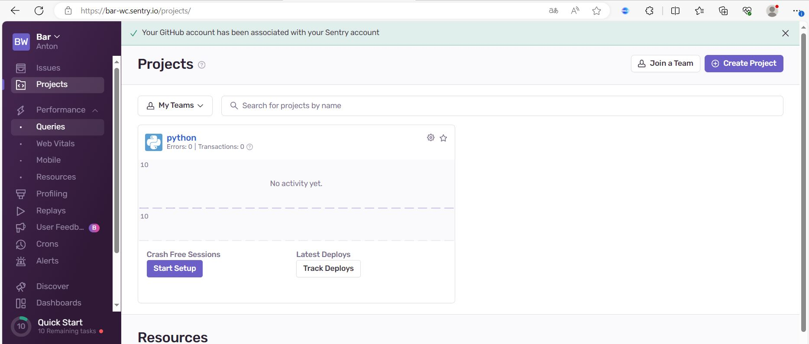
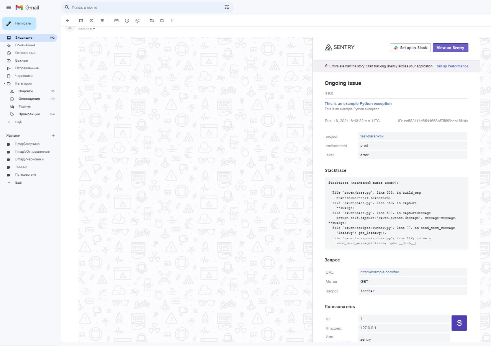

# Домашнее задание к занятию "14 «Средство визуализации Grafana» - Баранков Антон"

### Задание 1
Используя директорию help внутри этого домашнего задания, запустите связку prometheus-grafana.  
Зайдите в веб-интерфейс grafana, используя авторизационные данные, указанные в манифесте docker-compose.  
Подключите поднятый вами prometheus, как источник данных.  
Решение домашнего задания — скриншот веб-интерфейса grafana со списком подключенных Datasource.  

### Задание 2
Создайте Dashboard и в ней создайте Panels:  
утилизация CPU для nodeexporter (в процентах, 100-idle);  
CPULA 1/5/15;  
количество свободной оперативной памяти;  
количество места на файловой системе.  
Для решения этого задания приведите promql-запросы для выдачи этих метрик, а также скриншот получившейся Dashboard.  

100 - (rate(node_cpu_seconds_total{mode="idle"}[3m]))  

node_load1{job="nodeexporter"} or node_load5{job="nodeexporter"} or node_load15{job="nodeexporter"}  

node_memory_MemFree_bytes{job="nodeexporter"}  

node_filesystem_avail_bytes{mountpoint="/",job="nodeexporter"}  

### Задание 3
Создайте для каждой Dashboard подходящее правило alert — можно обратиться к первой лекции в блоке «Мониторинг».  
В качестве решения задания приведите скриншот вашей итоговой Dashboard.  

### Задание 4
Сохраните ваш Dashboard.Для этого перейдите в настройки Dashboard, выберите в боковом меню «JSON MODEL». Далее скопируйте отображаемое json-содержимое в отдельный файл и сохраните его.
В качестве решения задания приведите листинг этого файла.

[Файл json](img/json)
